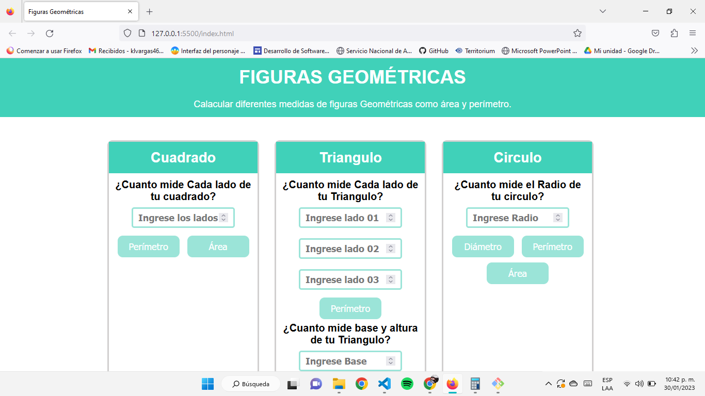

<h1 align="center"> Ejercicio Geometria JavaScript 🥰</h1>
<h4 align="center">Ejercicio RE basico pero aprendi!!</h4>

 

 

## Validaciones de campos tipo numero

 

## Construido con 🛠️

_Herramientas Utilizadas_

* [SwalAlert2](https://sweetalert2.github.io/#download) - Libreria para las alertas en JS
* JavaScript
* Html/Css - Lenguajes para el FrontEnd, plantilla sacada de material de Udemy

## Autores ✒️

* **Karen Vargas** - *Trabajo Inicial* - [KarenVargas](https://github.com/Karen11Vargas)

##  Adicionalmente🎁

* Mi primer proyecto de JavaScrip 📢
* Es poco pero trabajo honesto 😶‍🌫️